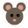

# 책상 쥐 (Desk Rat) 🐀

밈으로 유명한 그 "춤추는 쥐"가 바탕화면 우측 하단에 살아있는 **데스크톱 펫**입니다.
파일을 끌어다 주면 쥐가 잡아서 먹고(원본은 휴지통으로 이동), 다마고치처럼 다양하게 반응합니다.



## 기능

- **투명 오버레이** — 프레임 없는 투명 창이 항상 위에 떠 있고, 쥐 위가 아닌 곳은 클릭이 통과되어 바탕화면을 그대로 쓸 수 있습니다.
- **파일 먹이기** — 탐색기/바탕화면에서 파일이나 폴더를 쥐에게 끌어다 놓으면, 쥐가 두 손으로 잡아 먹고 **원본은 Windows 휴지통으로 이동**합니다.
- **로우폴리 댄스 쥐 모델** — 밈의 그 쥐처럼 날씬하고 각진 GTA3풍 폴리곤 + 저해상도 얼룩 텍스처. 뾰족한 주둥이와 큰 귀로 머리가 뚜렷이 분리됩니다.
- **시크하지만 다정한 반응들**
  - 평소엔 반쯤 감은 눈으로 숨 쉬며 시크하게 딴청 (눈 깜빡임, 귀 씰룩, 꼬리 살랑)
  - 커서가 다가오면 **눈을 동그랗게 뜨고 쳐다봄** (마우스 추적)
  - 파일을 끌고 오면 **두 팔을 뻗으며 입을 벌리고 갈망**
  - 팔을 뻗을 때 파일을 다시 빼면 **간절하게 "줘... 줘!!"** (약 올리기 반응)
  - 큰 파일을 먹으면 **배가 빵빵하게 불러** 졸린 표정으로 늘어짐
  - **좌클릭 = 찌르기** → 눈 질끈 감고 귀 내리며 아파함
  - **우클릭 = 쓰다듬기** → 눈 감고 흐뭇해하며 하트가 떠오름 ("...뭐, 나쁘진 않네")
  - **더블클릭 / 트레이 메뉴 = 춤!** → 밈처럼 양팔을 흔들며 신나게 춤춤 (♪)

## 다마고치 스탯 시스템

쥐는 **배고픔 · 애정 · 기력 · 체중** 스탯을 가지며, 값은 로컬에 저장돼 껐다 켜도 이어집니다.
쥐 위에 마우스를 올리면 **상태 바**(배고픔/애정/기력)가 떠오릅니다.

- 시간이 지나면 점점 **배고파**지고 ("...출출한데", "배고파 죽겠어..."), 파일을 먹으면 배고픔↓·체중↑
- 쓰다듬으면 **애정↑**, 찌르면 애정↓ — 애정이 높으면 대사와 반응이 더 살가워집니다
- 활동할수록 **기력↓**, 기력이 바닥나면 **잠**들어 💤 회복 (다가가거나 만지면 깸)
- 많이 먹으면 체중이 늘어 평소 배가 더 통통해집니다

## 스스로 살아가는 쥐 (Life System)

가만히 두면 쥐는 알아서 자기 삶을 삽니다 (`renderer/life.js`의 자율 행동 두뇌):

- **돌아다니기** — 바닥을 따라 화면 곳곳을 **측면 자세로 걸어다님** (창 자체가 이동, 다리·꼬리 움직임)
- **눕기 / 낮잠** — 퍼져 눕거나, 기력이 낮으면 다리를 뻗고 잠들어 💤 기력 회복
- **세수(그루밍)** — 두 앞발로 얼굴을 비비며 단장 ✨
- **줌미스** — 기분 최고일 땐 신나게 화면을 가로질러 질주 💨
- **채집** — 배고프면 분주하게 돌아다니며 먹을 걸 찾음
- 각 활동마다 시크한 혼잣말 ("...심심하네.", "햇볕 좋다.", "귀찮아.")
- 마우스가 다가오면 하던 걸 멈추고 **사용자에게 집중**합니다

> 멀리 가버린 쥐는 트레이 메뉴 **"구석으로 부르기"** 로 다시 부를 수 있어요.

## 실행

```bash
npm install
npm start
```

- 종료: 시스템 트레이의 쥐 아이콘 → **종료**
- Windows 10/11, Node.js 18+ 필요

## 기술

- **Electron** — 투명·항상위 오버레이 창, 글로벌 커서 폴링으로 클릭스루를 드래그 중에도 안전하게 토글, `shell.trashItem()`으로 유니코드 안전 휴지통 이동
- **Three.js** — 프리미티브로 직접 리깅한 3D 쥐 모델. 모든 관절(목/턱/눈꺼풀/귀/팔꿈치/꼬리)을 상태머신으로 구동해 숨쉬기·쳐다보기·뻗기·먹기·찌르기·쓰다듬기를 부드럽게 보간

## 구조

```
main.js            # Electron 메인: 오버레이 창, 커서 폴링, 휴지통 이동, 트레이
preload.js         # 안전한 IPC 브리지 (파일 경로 해석, 휴지통, 커서)
renderer/
  index.html       # 캔버스 + 말풍선
  app.js           # 씬/조명/상태머신/인터랙션/포즈
  rat.js           # 절차적 로우폴리 3D 쥐 모델 (리깅된 관절)
  life.js          # 자율 행동 두뇌 (배회/눕기/낮잠/그루밍/줌미스) — 순수 로직
  vendor/three.module.js
assets/tray.png    # 트레이 아이콘
```

## 개발용 플래그

- `DESKRAT_TEST=1 npm start` — 시작 2.5초 후 임시 파일을 자동으로 먹어 휴지통 이동까지 검증
- `DESKRAT_DEMO=1 npm start` — 모든 포즈를 순서대로 순회하며 디버그 오버레이 표시

## 라이선스

MIT
